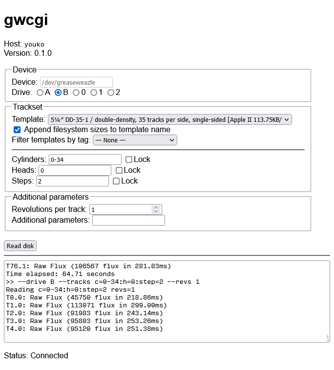

Greaseweazle CGI Interface
==========================

Web interface to Greaseweazle host tools.

The only sensible use case I can think of is something like mine,
in which my Greaseweazle and thus drives are connected to a PC other than
the one at my desk.
(To be fair, this was $80 cheaper than a dual 5¼″ drive bay enclosure.)



Installation
------------

Dependencies:
* Git
* Perl 5
* [Greaseweazle](//github.com/keirf/greaseweazle)
* [websocketd](//github.com/joewalnes/websocketd)
* A webserver, e.g. Apache

If Greaseweazle isn’t installed to your `PATH`, edit `gw-wrapper.sh`
to reflect its location.

### Directions

1. Clone this repository into somewhere served by your webserver, e.g.
   `/var/www/gwcgi`, and `cd` to that directory.
   (From here on, this directory will just be called `/path/to/gwcgi`
   for sanity.)
2. Configure your webserver to allow CGI scripts to be executed in
   `/path/to/gwcgi`.
3. Create a directory called `images`, i.e. `/path/to/gwcgi/images`.
   Make it writable by the user which will be running `index.cgi`
   (probably `www` or `apache` or something).
4. Change the value of `$ws_addr` in `index.cgi` to reflect your
   webserver’s address.
   The port you choose can be arbitrary, but make sure it isn’t firewalled.
5. Set up websocketd to run `gw-wrapper.sh` on the port entered above:
   `websocketd --port 8080 ./gw-wrapper.sh` or something similar.

Notes
-----

* There are a few duplicate templates—e.g. 5¼″ quad-density and high-density formats
  both having 80 tracks at 96 TPI, thus using the same parameters when invoking
  Greaseweazle—, but these are to simplify the dropdown menu and to avoid having
  up to three density and/or BPI specifications on one entry.

Known issues
------------

* Text input is not validated and as such `gw-wrapper.sh` might be vulnerable
  to something like this:
  ```sh
  args=--help; cat /etc/passwd
  ./gw $args
  #./gw --help; cat /etc/passwd
  ```
  (i.e. arbitrary strings can be passed through the websocket).
  However, given gwcgi is only intended to be accessed via LAN, this doesn’t
  seem to be a pressing issue, especially given a user can simply firewall
  the computer on which gwcgi is run.
  Input validation, however, *is* on the to-do list below.

To-do
-----

* Make the code suck less
* More configurability
* Include BPI info
* Validation of input
